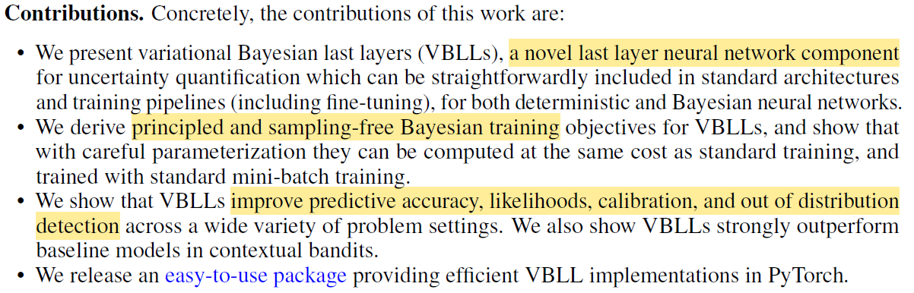
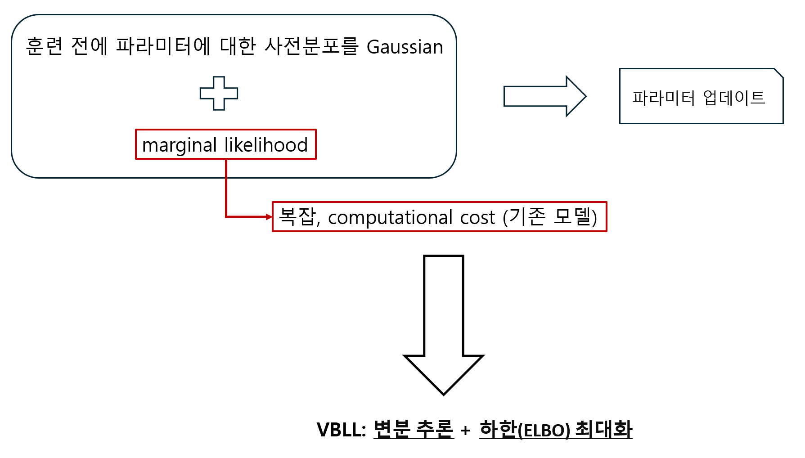
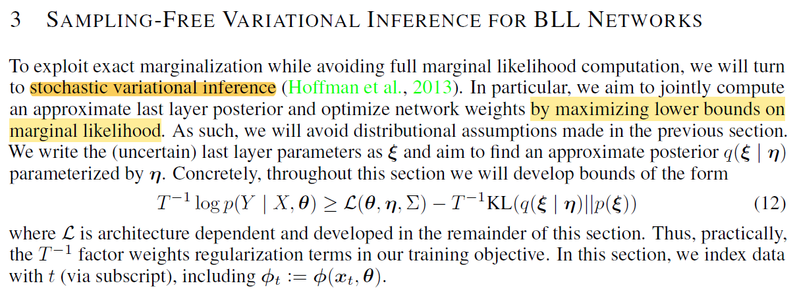

# Project Description

인공신경망과 딥러닝_팀프로젝트

Reproducibility

# Abstract
 **VARIATIONAL BAYESIAN LAST LAYERS** 논문으로 팀프로젝트를 진행함

 repo 에 포함된 재구현 코드는 저자가 제공한 코드를 각색한 것으로, origianl code는 저자의 공식 repo를 통해 확인할 수 있음

 코드 사용과 논문에 대한 이해를 돕기 위해 Paper overview 섹션에서 논문의 주요 내용에 대해 서술함

# Paper overview

**VARIATIONAL BAYESIAN LAST LAYERS** 논문은 Google DeepMind의 James Harrison이 1저자로 2024년에 발간된 논문이다

~

논문의 주요 motivation은 기존의 많은 불확실성을 측정하는 방법들의 complexity이다 

논문에서 제안하는 VBLL 방법은 ~ 장점이 있다. 이제 VBLL의 작동 방식에 대해 살펴보자

먼저 BLL에 대해 간략히 설명하면,

그래서 여러 task들 중 regression의 경우에 대해 BLL을 설명하고 있는 것을 보면, 

즉, 이를 쉽게 내 언어로 이해한 것을 그림으로 도식해보면 다음과 같다

앞서 말한 mariginal likelihood는 (11)식과 같으며, 

따라서 논문에서는 (12)식과 같은 관계에서 오른쪽항을 최대화 함으로써, 즉

