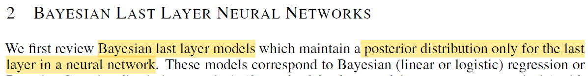
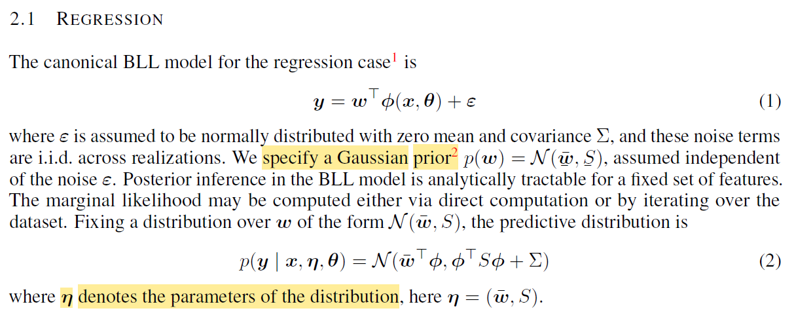
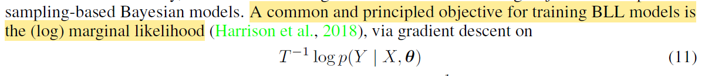

# Project Description

인공신경망과 딥러닝_팀프로젝트

24510101 김상훈

**Reproducibility Challenges**

# Abstract
 **VARIATIONAL BAYESIAN LAST LAYERS** 논문으로 재현성 (MLRC) 팀프로젝트를 진행함

 repo 에 포함된 재구현 코드는 저자가 제공한 코드를 각색한 것으로, origianl code는 저자의 공식 repo를 통해 확인할 수 있음 (https://github.com/vectorinstitute/vbll)

 코드 사용과 논문에 대한 이해를 돕기 위해, 아래의 Paper overview 섹션에서 논문의 주요 내용에 대해 서술함

# Paper overview

##
**[VARIATIONAL BAYESIAN LAST LAYERS]** 논문은 Google DeepMind의 James Harrison이 1저자로 2024년에 4월 17일에 accepted된 논문이다 (https://arxiv.org/abs/2404.11599)

내가 이 논문을 고른 몇가지 이유가 있다

- 딥러닝의 방법론을 다루고 있기 때문에 mlrc와 적합하다고 생각했다

- 구글 딥마인드에서 발간된, 아주 최신 논문이라는 점이 읽어보고 싶게 했다

- 논문을 다 읽고 나니 앞으로 내 연구생활에 도움이 될 것 같다는 느낌을 받았다 (다른 알고리즘과의 결합 가능성)

##

##

논문의 주요 motivation은 기존의 많은 불확실성을 측정하는 방법들의 complexity 가 핵심이라고 할 수 있다 

##

##
논문에서 제안하는 VBLL 방법은 위와 같은 장점이 있다 

##

##
VBLL의 성능은 왼쪽의 그림과 같은 Regression, 오른쪽과 같은 Classification 두 task에 대해 성능 측정 및 분석이 진행된다

이번 재구현 프로젝트도 이 두 task 에 대해 진행되었고,

이제 VBLL의 작동방식에 대해 알아보자

##

##

먼저 Bayesian Last Layer (BLL) 에 대해 간략히 설명하면, 아주 간단하다

**Neural Network의 마지막 층에 Bayesian 추론을 적용**하면, 그것이 BLL이다 

그럼 이러한 짓을 왜 할까?
- 예측 결과에 대한 불확실성 정량화
- 과적합 방지
- 작은 데이터셋에서도 좋은 성능 (효율성)
- Out of Dist. (OOD) 검출에 효과적

등이 있다

##

##
논문에서 설명하는 여러 task들 중 regression의 BLL 수식은 위와 같다 

다른 

##

##

BLL에서 VBLL로 발전되는 과정을, 쉽게 도식화해보면 위와 같다

아이디어는 단순하지만 매우 뛰어나다

그리고 이를 구현하기 위한 수학적 백그라운드와 많은 수식은 논문을 참고하면 된다

##

앞서 도식의 (log) mariginal likelihood 는 equation (11) 과 같다

논문의 핵심 motivation이자 기존 모델들의 문제점은

**mariginal likelihood 를 정확하게 계산 (적분) 한다는 것**, 이는 
- 계산 복잡성
- 편향된 그래디언트 추정
- 과적합

등의 문제가 있다

##

따라서 논문에서 제안된 VBLL은 

**변분 추론**을 통해 (12)식 오른쪽항 **(mariginal likelihood의 하한)을 최대화** 하는 방법을 사용한다. 이때,
- $\ \mathcal{L}(\theta, \eta, \Sigma) \$는 모델 아키텍처에 의존적인 함수로, 주변 가능성의 하한을 나타낸다
- $\ \mathrm{KL}(q(\xi \mid \eta) \parallel p(\xi)) \$는 근사 사후 분포와 실제 사후 분포 사이의 KL divergence)다. 이 발산은 근사와 실제 분포 사이의 차이로, 이를 최소화해야한다
- $\ \frac{1}{T} \$는 데이터셋 크기에 따른 정규화 요소로, 표준 비베이지안 훈련 파이프라인과 비교 및 일관된 학습 목표를 위해 사용된다

